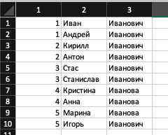

Andersen spring random project

This application should return random pair of students, where 1st is 
questioner,2nd is respondent;
* If question is good, user can receive point
* If answer is good, user can receive point, else user gets nothing or subtract a point
* User's from same team, can't ask a question to each other, 
but if last 2 user's in queue from same team - they must ask question to each other.

##How to use Excel import:
1. Make this format of excel data:

2. Set path of your's excel file to that input block

3. Press that button

4. ... Done

TODO:
* [x] Add text validator, which consume some String and receive List of Students to Repository
* [x] Add function to import .xlsx to database
* [ ] Add new frontend realization
* [ ] Code refactoring

Used stack:
* JDK 11
* Spring boot
* AngularJs

Dependencies:
* Spring web
* Spring data JPA
* Spring test
* Thymeleaf (AngularJs - frontend)
* H2 (PostgreSQL - production)
* Lombok
